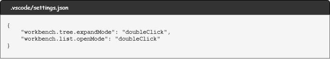

# Configurações extras no VSCode

> **Date**: *17/06/2022*
> **Author**: *Haroldo Cruz*
> **PC1**: *Notebook Xiaomi Mi Air 13.3 | Windows 10 + WSL 2 + Ubuntu 20.04*
> **PC2**: *Notebook Dell Vostro 15 5510 | Windows 11 + WSL 2 + Ubuntu 22.04*

**SUMÁRIO**

- [Configurações extras no VSCode](#configurações-extras-no-vscode)
  - [Atribuindo clique duplo no explorer (árvore de diretórios)](#atribuindo-clique-duplo-no-explorer-árvore-de-diretórios)

## Atribuindo clique duplo no explorer (árvore de diretórios)

> As vezes queremos apenas navegar no explorer sem incômodo, mover um arquivo/pasta sem abrí-lo, mas quando clicamos em algo, ele vai logo abrindo.

Abra as configurações (<kbd>ctrl</kbd> + <kbd>,</kbd>)

Pesquise a palavra `singleClick`

Na aba `User`, vá em `Workbench > Tree: Expand Mode` e `Workbench > List: Open Mode`, e mude-os para `doubleClick`.

Outra alternativa é alterar o arquivo `settings.json`, inserindo/alterando nele as seguintes linhas:

```json
// .vscode/settings.json

{
    "workbench.tree.expandMode": "doubleClick",
    "workbench.list.openMode": "doubleClick"
}
```


