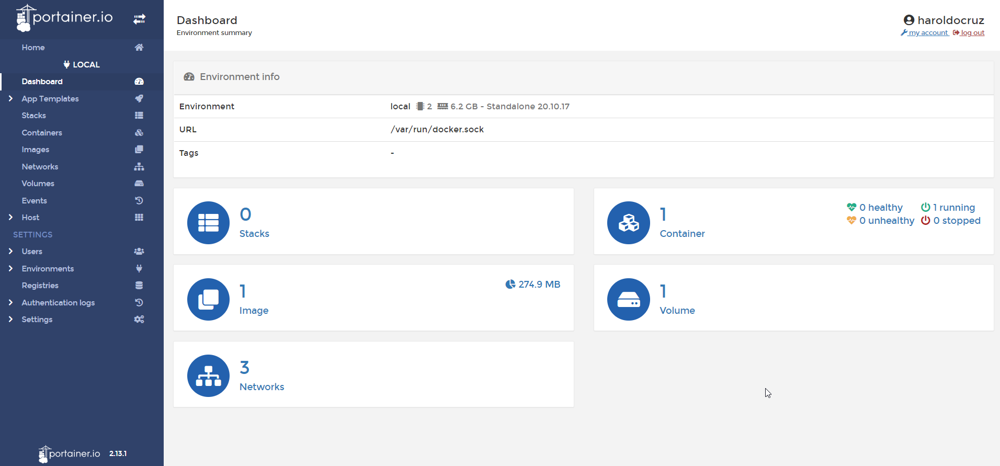

# Trabalhando produtivamente com Docker

> **Date**: *17/06/2022*
> **Author**: *Haroldo Cruz*
> **PC1**: *Notebook Xiaomi Mi Air 13.3 | Windows 10 + WSL 2 + Ubuntu 20.04*
> **PC2**: *Notebook Dell Vostro 15 5510 | Windows 11 + WSL 2 + Ubuntu 22.04*

**SUMÁRIO**

- [Trabalhando produtivamente com Docker](#trabalhando-produtivamente-com-docker)
  - [Portainer: Criar e gerenciar containers facilmente](#portainer-criar-e-gerenciar-containers-facilmente)
    - [Executando uma instância do Portainer](#executando-uma-instância-do-portainer)

## Portainer: Criar e gerenciar containers facilmente

> **Referência**: https://docs.portainer.io/v/ce-2.11/ | https://github.com/portainer/portainer-docs | https://hub.docker.com/r/portainer/portainer-ce

> O Portainer CE é um poderoso conjunto de ferramentas de código aberto que permite criar e gerenciar contêineres facilmente no Docker, Docker Swarm, Kubernetes e Azure ACI. Ele esconde a complexidade do gerenciamento de contêineres por trás de uma interface de usuário fácil de usar.



### Executando uma instância do Portainer

Para baixar o comando é simples, basta digitar:

```bash
# baixando a imagem
docker pull portainer/portainer-ce

# criando um volume para armazenamento dos dados
docker volume create portainer_data

# criando e executando um container
docker run -d --name portainer --restart=always \
-p 8000:8000 -p 9000:9000 -p 9443:9443 \
-v /var/run/docker.sock:/var/run/docker.sock \
-v portainer_data:/data \
portainer/portainer-ce:2.18.3
```

> • `-d` significa `daemon` e serve para manter o container executando em background (em segundo plano), liberando o shell para uso;
> • `-p` é usado para mapear as portas, neste caso, apontando a porta `9443` do container para a porta `9443` do sistema hospedeiro, o mesmo com as portas `8000`;
> • `--name` para dar um nome ao container;
> • `--restart always` para que, em caso do processo do container ser interrompido, ele seja reiniciado automaticamente;
> • `-v` significa `volume` e serve para mapear uma pasta, fazendo uma comunicação de duas vias entre o ambiente interno (container) e o externo (sistema hospedeiro). Ele mantêm as pastas sincronizadas;
> • `portainer/portainer-ce` é a imagem que será utilizada para criar o container.
>
> A porta `9443` é a porta padrão do projeto Portainer para a UI.
> A porta `9000` é uma porta legado do projeto Portainer ainda mantida.
> A porta `8000` é a porta padrão para o TCP tunnel server (não será abordado aqui).

**Nota**: Se a imagem não tiver sido baixada anteriormente, o comando fará o download desta e das imagens necessárias para a execução do container.

**Nota**: Para parar um container com o parâmetro `--restart=always`, é necessário atualizar o container em execução e para isso use o comando `docker container update --restart=no <id-do-container>`

---
